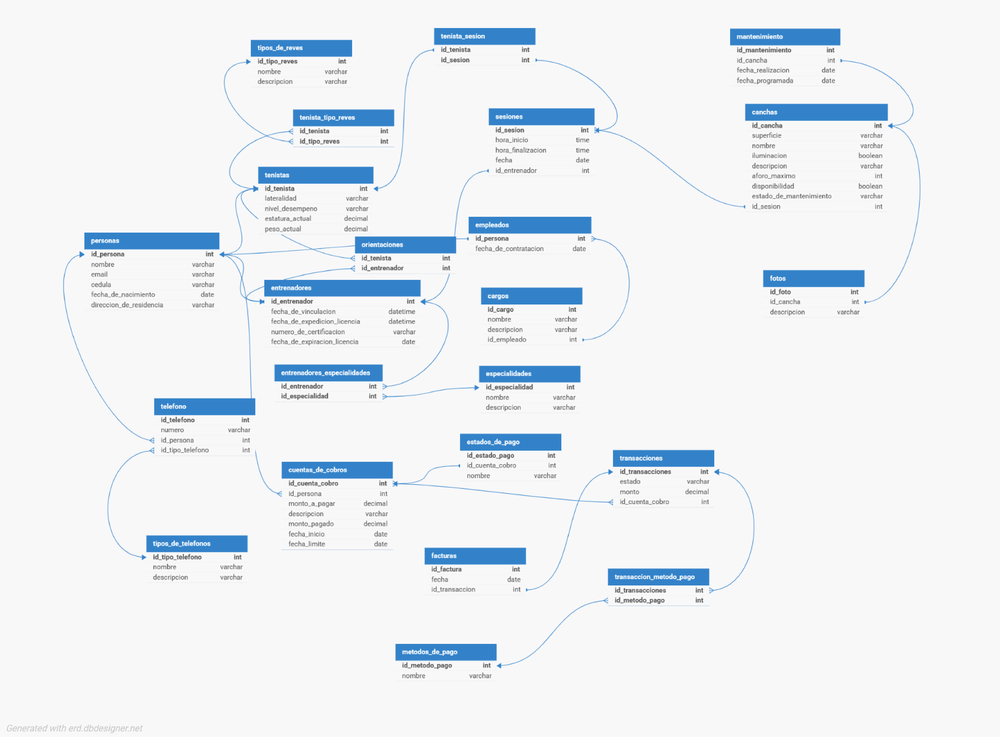

# 🎾 MatchPoint: Sistema de Gestión de Academias de Tenis

**MatchPoint** es una solución integral diseñada para centralizar la operación técnica y administrativa de clubes formativos de tenis de campo. Esta herramienta permite gestionar la trayectoria deportiva, el control financiero y la planificación de entrenamientos en un solo lugar.

---

## 👥 Equipo de Desarrollo
* **Andry Dayani Polo Granados**
* **Maria Angelica Guerrero Mendez**
* **Cassiannil Chiquinquira Hernandez Madueño**
* **Emanuel De Jesus Lopez Lopez**
* **Santiago Said Gonzalez Danies**
* **Cristian David Echavarria Castro**

---

## 🎯 Objetivos del Proyecto
* **Centralización de Datos:** Registro único de deportistas y su historial evolutivo.
* **Seguimiento Técnico:** Monitoreo detallado de golpes (drive, revés, saque) y condición física.
* **Gestión Operativa:** Planificación de sesiones en cancha y participación en torneos.
* **Control Administrativo:** Gestión de mensualidades, pagos y estados de cuenta de acudientes.

---

## 🛠️ Stack Tecnológico
* **Motor de Base de Datos:** Microsoft SQL Server
* **Modelado:** ERDPlus / DBDesigner
* **Documentación:** Markdown para GitHub

# 📐 Diseño de la Base de Datos (Primera Versión)

  
<b>💬 Historias de usuario</b>

  

     
    <a href="requirements/first_version/Historias_de_usuario.pdf">📄 Ver Documento de Historias de Usuario</a>
     
    <i>Haga clic en el enlace para revisar los requerimientos funcionales.</i>
  

  
<b>🖼️ Modelo conceptual</b>

 
 

  
<b>👤 Módulo de Actores del Sistema y Perfiles Técnicos</b>

  

     
    
     
    <i>Gestión de datos personales, cargos, entrenadores y caracterización técnica del tenista (tipo de revés, lateralidad).</i>
  

  
<b>💰 Módulo de Administración Financiera</b>

  

     
    
     
    <i>Control de mensualidades, registro de transacciones, métodos de pago y estados de cuenta.</i>
  

  
<b>🎾 Módulo de Gestión de Escenarios y Sesiones</b>

  

     
     
     
    <i>Planificación de sesiones de entrenamiento, disponibilidad de canchas, mantenimiento y registro visual.</i>
  

  
<b>📊 Modelo logico </b>

  

     
    
     
    <i>Control de mensualidades, registro de transacciones, métodos de pago y estados de cuenta.</i>
  

  
<b>💻 Modelo fisico (SQL)</b>

   
   El código fuente completo para la creación de tablas, relaciones y restricciones se encuentra alojado en este repositorio.
  

